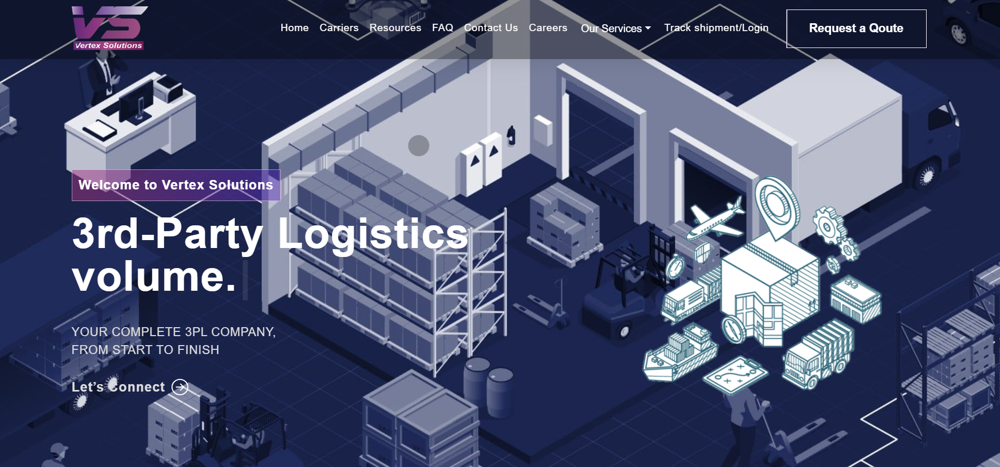

# Logistics Management Web Application

## Overview

This is a responsive and efficient web application developed using React.js and Node.js that caters to the needs of a logistics management company. It provides customers with comprehensive information about our services and how we can assist them. From requesting quotes to tracking shipments, our web application serves as a one-stop solution for all logistic requirements.

## Key Features

- **Quote Requests**: Customers can easily request a quote through the application.
- **Shipment Tracking**: The application offers a seamless shipment tracking feature.
- **Email Notifications**: Integrated with a server that sends out well-formatted email notifications using `juice.css`.

## Technology Stack

- Frontend: React.js
- Backend: Node.js
- Email Templates: `juice.css`

## How to Run Locally

Please provide instructions here on how to clone and run the application locally, for example:

1. Clone the repository: `git clone <repo-url>`
2. Install dependencies: `npm install`
3. Run the server: `<command to run server>`
4. Run the client: `npm start`

## Future Work

While the web application is live and fully functional, we continually strive to improve and add new features. Any suggestions or contributions are welcome!

